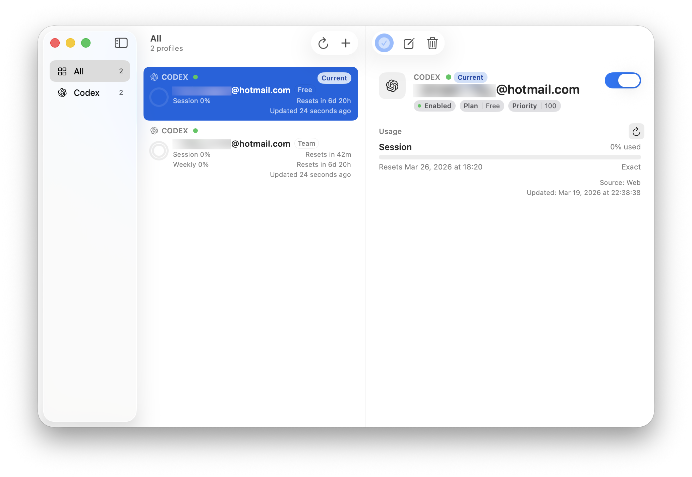
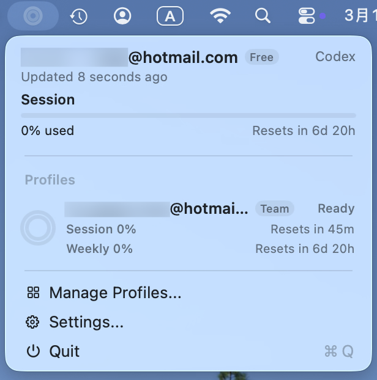

# AgentRelay

AgentRelay is a native macOS app and a cross-platform CLI for managing local coding-agent profiles. It keeps multiple Codex profiles organized, switches them transactionally with validation and rollback, surfaces usage and diagnostics, and works from both a native macOS control plane and the terminal.

The product name is `AgentRelay`, the CLI binary is `agrelay`, and the current provider scope is `Codex`.

## Two Product Surfaces

### macOS App

The macOS app is a native control plane for people who want profile switching and status visibility without living in the terminal. It launches `agrelay daemon --stdio`, stays in sync over stdio JSON-RPC, and keeps switching and validation logic in the shared CLI/core runtime instead of duplicating it in the UI.

#### Screenshots

One control plane, two fast views: Profiles for confident switching, and the menu bar for instant status and actions.

<p align="center">
	
</p>

<p align="center">
	
</p>

See the app guide at [`apps/relay-macos/README.md`](./apps/relay-macos/README.md).

### Cross-Platform CLI

The CLI is the execution engine for profile management, switching, usage refresh, diagnostics, and programmatic integration. It is the primary automation surface and supports stable structured output with `--json` on every user-visible command.

See the operator guide at [`docs/install.md`](./docs/install.md).

## Core Workflows

- bring existing Codex setups under management with `agrelay codex import`, or create new managed entries with `agrelay codex add`
- switch profiles safely without replacing the entire agent home or dragging unrelated session artifacts along
- refresh usage and inspect current health before starting a session
- expose logs, activity events, and exportable diagnostics for support and debugging
- host a long-lived daemon session for the macOS app and other clients that want a persistent control plane

## Get Started

If you want to try the CLI quickly:

```bash
cargo install --path apps/relay-cli
agrelay doctor --json
agrelay codex import --nickname work --json
# or: agrelay codex add --nickname work --agent-home /path/to/codex-home --json
agrelay list --json
```

For the full install flow, command reference, troubleshooting, and common workflows, use [`docs/install.md`](./docs/install.md).

## Documentation Map

Product and operator docs:

- [Install, Quick Start, and CLI Usage](./docs/install.md)
- [macOS App Guide](./apps/relay-macos/README.md)

Technical reference:

- [Architecture](./docs/architecture.md)
- [Development](./docs/development.md)
- [SQLite Schema](./docs/sqlite-schema.md)
- [Linux Support](./docs/linux-support.md)
- [Security Checklist](./docs/security-checklist.md)
